# 🎟️ Can you get it - 터지지 않는 티켓팅 플랫폼


- [서비스 개요](#✨-서비스-개요)
- [서비스 소개](#🎮-서비스-소개)
- [주요 기술](#🎯-주요-기술)
  - MSA
    - [spring 서버 및 DB를 기능별로 분리](#spring-서버-및-db를-기능별로-분리)
    - [spring gateway 및 spring eureka](#spring-gateway-및-spring-eureka)
    - [Feign Client를 이용한 서버 간 통신](#feign-client를-이용한-서버-간-통신)
  - 쿠버네티스
    - [도커 컨테이너 오케스트레이션]()
    - [롤링 업데이트를 통한 무중단 배포](#롤링-업데이트를-통한-무중단-배포)
    - [헬름차트를 이용한 쿠버네티스 리소스 관리]()
    - [오토 스케일링]()
  - 테스트 및 모니터링
    - [locust를 이용한 티켓팅 봇 및 성능테스트](#locust를-이용한-티켓팅-봇-및-성능테스트)
    - [jacoco를 이용한 코드 커버리지 측정](#jacoco를-이용한-코드-커버리지-측정)
    - [ELK Stack + kafka를 이용한 로그 수집](#elk-stack--kafka를-이용한-로그-수집)
    - [grafana와 prometheus를 이용한 자원 관리](#grafana와-prometheus를-이용한-자원-관리)

  - 정산 시스템
    - [Spring Batch를 이용한 정산 시스템](#spring-batch를-이용한-정산-시스템)

  - 대기열 시스템
    - [kafka를 이용한 대기열 시스템](#kafka를-이용한-대기열-시스템)

  - 프론트
    - [Observer를 이용한 무한 스크롤 구현](#observer를-이용한-무한-스크롤-구현)
    - [Recoil을 활용한 로그인 정보 유지](#recoil을-활용한-로그인-정보-유지)

  - 기타
    - [OAuth를 이용한 카카오 로그인](#oauth를-이용한-카카오-로그인)
    - [카카오페이 연동을 통한 포인트 충전 시스템](#카카오페이-연동을-통한-포인트-충전-시스템)     

- [기술 스택](#🔧-기술-스택)
- [프로젝트 산출물](#📃-프로젝트-산출물)
- [협업 환경](#💑-협업-환경)
- [팀원 소개](#👨‍💻-팀원-소개)

<br>

---

# 👨‍💻 팀원 소개

팀명 : `All Back`  
저희 팀은 처음부터 백엔드 및 인프라 기술을 집중적으로 공부하고 구현하는 것을 목표로 구성된 팀으로, 5명 전원이 모두 백엔드 개발에 참여하였습니다. 이러한 취지를 담아 팀명을 `All Back`으로 정하였습니다.

| 이름 | 역할 | github |
| --- | --- | --- |
| 성원준(팀장) | Payment 서버 개발, Gateway 및 Eureka 서버 개발, CI/CD, 쿠버네티스 적용 | https://github.com/wlwlsus   |
| 김동연 | User 서버 개발 및 배포, 테스트 봇 개발, locust 성능 테스트 | https://github.com/EastFlovv |
| 김정수 | 프론트 react 개발, Concert 서버 개발 | https://github.com/kjskjs356 |
| 윤호산 | Concert 서버 개발, Spring Batch 정산 시스템 개발 | https://github.com/hosanyoon |
| 최준아 | ELK Stack 로그 수집 시스템 구축, 대기열 시스템 개발, 코드 커버리지 | https://github.com/wnsdk     |

---

# ✨ 서비스 개요

- 프로젝트 진행 기간 : 2023.04.10(월) ~ 2023.05.19(금) (6주간 진행)
- 사이트 링크 : http://allback.site
- 소개 영상 : [유튜브 링크](https://youtu.be/vDYpLbszSlw)
- 시연 영상 : [유튜브 링크](https://youtu.be/N99n9vhIdLo)

티켓팅 사이트 `Can You Get It`은 주최자가 등록한 공연들 중에서 원하는 공연의 좌석을 선택해 결제할 수 있는 서비스를 제공합니다.  
티켓팅의 특징이라고 한다면, 특정한 시각에 사람들이 한꺼번에 몰려 트래픽이 집중된다는 것입니다. 저희 팀은 이러한 상황에서도 서버가 터지지 않게 하기 위한 안정적인 아키텍처를 고민해보고 프로젝트에 적용해보았습니다.

<br>

---

# 🎮 서비스 소개

1. 로그인  
 <br>

2. 공연 목록 조회  
 <br>

3. 공연 예매  
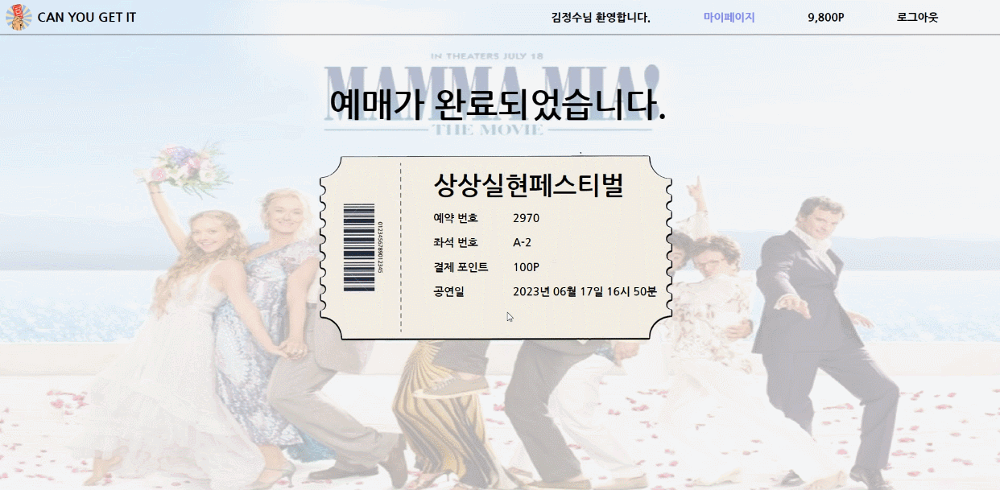 <br>

4. 마이페이지 조회 및 예약 취소
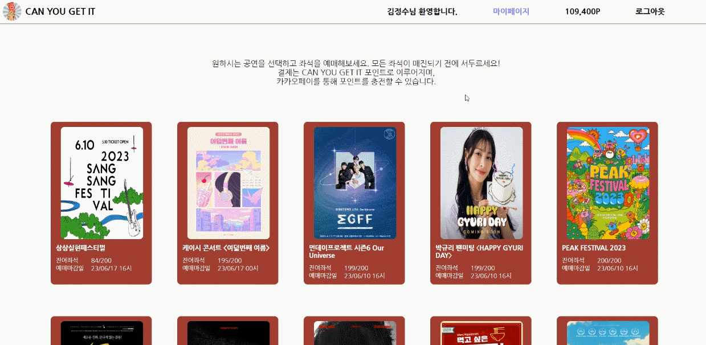 <br>

5. 카카오페이를 통한 포인트 충전
 <br>

6. 대기열 시스템  
- 대기열 통과  
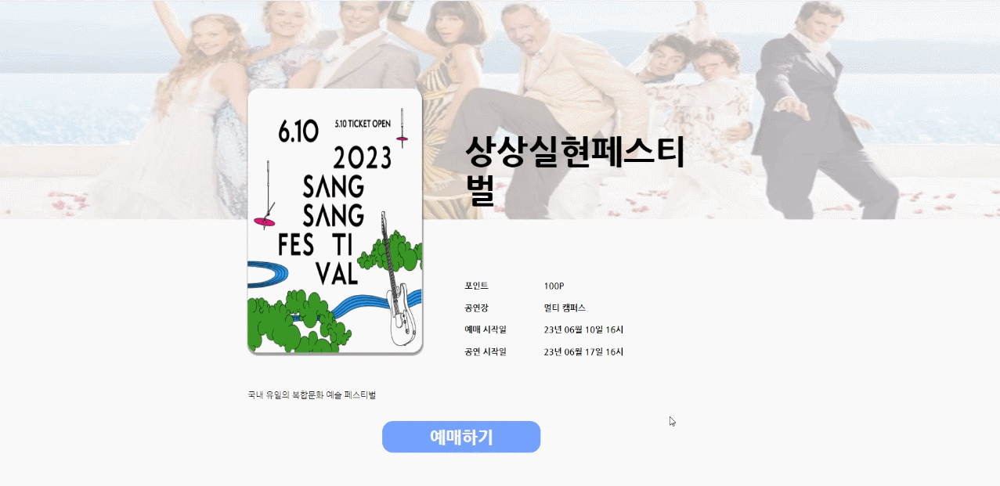 <br> 
- 대기열 취소  
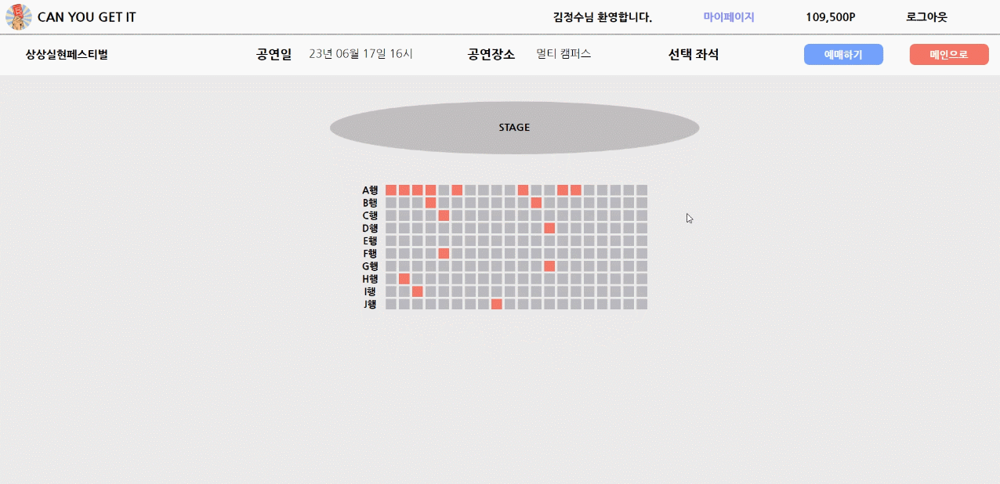 <br>

7. 관리자 페이지 조회
 <br>
     <br>

---

# 🎯 주요 기술

## ✔ MSA
### spring 서버 및 DB를 기능별로 분리
MSA란 `MicroService Architecture`의 약자로, 기존의 Monolithic Architecture의 한계를 벗어나 애플리케이션을 느슨하게 결합된 서비스의 모임으로 구조화하는 서비스 지향 아키텍처(SOA) 스타일의 일종인 소프트웨어 개발 기법입니다. 

기능을 크게 4가지로 분류하고, 서버와 데이터베이스를 각 기능에 맞게 분류하여 구현하였습니다. 

| 기능 | Server | DB |
| --- | --- | --- |
| 사용자 | User Server | User DB |
| 공연 | Concert Server | Concert DB |
| 결제 | Payment Server | Payment DB |
| 관리자 | Admin Server | |


저희는 `MSA` 를 통해 다음과 같은 장점을 가질 수 있었습니다. 

1. 배포
    - 서비스별 개별 배포가 가능합니다.
    - 특정 서비스의 요구사항만을 반영하여, 빠르게 배포 가능합니다.
2. 확장
   - 특정 서비스에 대한 확장성(scale-out)이 유리합니다.
    - 클라우드 기반 서비스 사용에 적합합니다.
3. 장애
    - 일부 장애가 전체 서비스로 확장될 가능성이 적습니다.
    - 부분적으로 발생하는 장애에 대한 격리가 수월합니다.
4. 그 외
    - 새로운 기술을 적용하기 유연합니다.
    - 각각의 서비스에 대한 구조 파악 및 분석이 모놀리식 구조에 비해 쉽습니다.


또한, `MSA` 를 구현하기 위해 각 기능과 역할별로 구분하여 브랜치를 구성하였습니다. 

> Branch Name Convention : `(deploy/dev)` - `(back/front)` - `(service)`

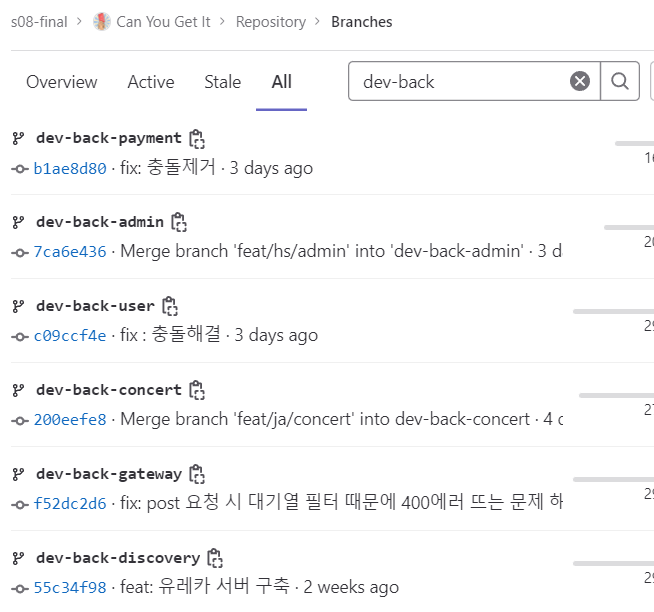
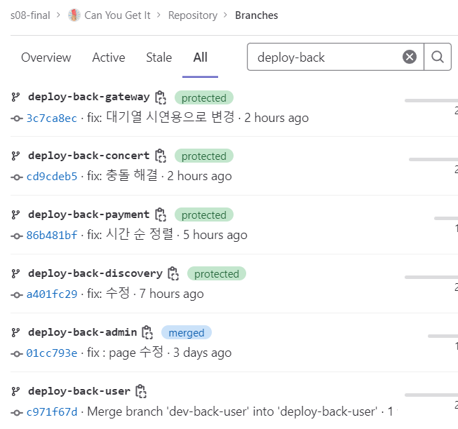


<br><br><br>

### spring gateway 및 spring eureka

기능별로 서버를 여러 개로 분리하였기 때문에, client에서 server로 요청을 보낼 때 어떤 서버로 요청을 전달해야 할 지 혼란스러울 수 있습니다. 저희는 따라서 gateway 서버를 구축하여 클라이언트로부터 들어온 요청을 라우팅하였습니다.

`Spring Cloud Gateway` :
마이크로서비스 아키텍처에서 API 게이트웨이를 구축하기 위한 라이브러리입니다. API 게이트웨이는 클라이언트와 마이크로서비스 간의 통신을 중개하고 라우팅하는 역할을 수행합니다.  
Eureka와 같은 서비스 디스커버리 클라이언트와 통합하여 동적으로 서비스를 발견(discovery)할 수 있습니다.

`Spring Cloud Eureka` :
마이크로서비스 아키텍처에서는 많은 수의 서비스 인스턴스가 동적으로 생성되고 제거되기 때문에, 이러한 서비스들을 효과적으로 관리하고 찾을 수 있는 메커니즘이 필요합니다. Eureka는 이러한 목적으로 사용됩니다.  
서비스 인스턴스들은 Eureka 서버에 자신의 정보를 등록합니다. 클라이언트는 Eureka 서버에 등록된 서비스를 검색할 수 있습니다. 이를 통해 동적으로 서비스 인스턴스를 찾아 요청을 전달할 수 있습니다.

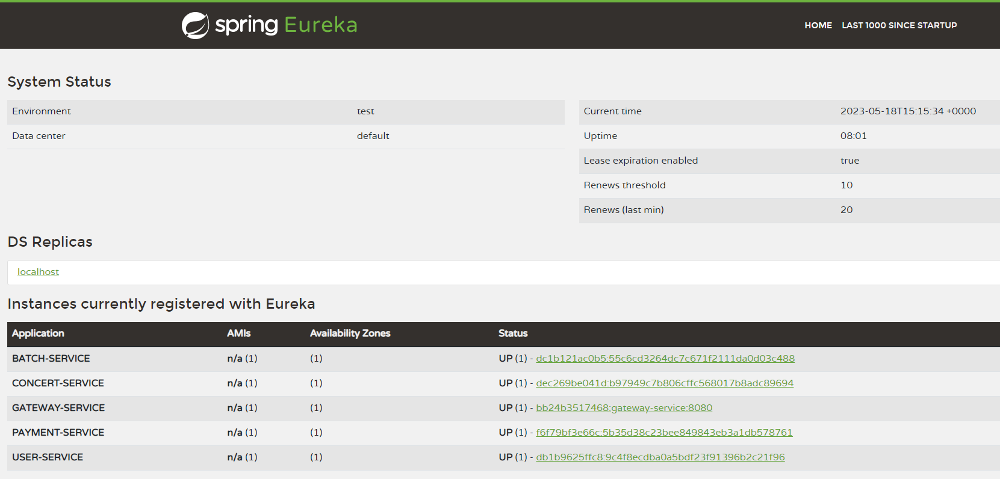

eureka 서버가 제공하는 기능은 쿠버네티스에서도 제공하고 있습니다. 저희 프로젝트에서는 쿠버네티스를 적용하기 전 단계까지만 eureka 서버를 사용하였고, 쿠버네티스 적용 이후에는 eureka 서버를 중지하였습니다.

<br><br><br>

### Feign Client를 이용한 서버 간 통신

MSA를 적용함으로써 서버들이 기능별로 분리됨에 따라 각 서버는 자신이 관할하는 DB에만 직접 접근할 수 있게 되었습니다. 그로 인해 자신이 관할하지 않는 DB의 데이터가 필요할 경우, 해당 DB를 담당하고 있는 서버에게 데이터를 요청해야합니다.  
저희는 서버 간 통신을 하기 위해 `Feign Client`를 사용하여 기존의 RestTemplate 보다 Rest API를 사용하는데 필요한 설정을 간소화하였고, 이로 인해 비지니스 로직에 더 집중할 수 있었습니다.

- Feign - Netflix 에서 개발된 Http client binder 
- 웹 서비스 클라이언트를 보다 쉽게 작성하여 사용 
- interface 를 작성하고 annotation 을 선언하여 사용 
- `@EnableFeignClients` 을 통해 `@FeignClient`의 구현체를 구현

<br><br><br>

## ✔ 쿠버네티스

### 도커 컨테이너 오케스트레이션

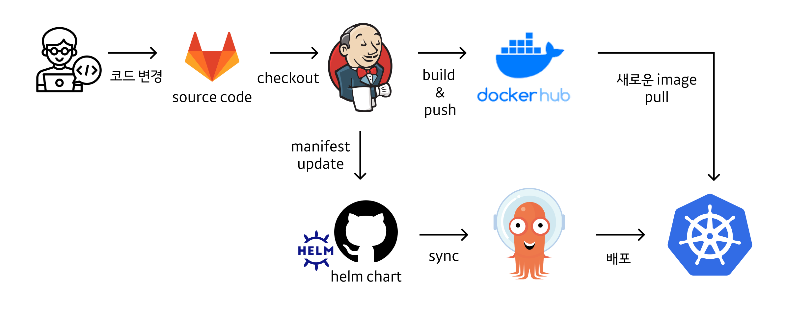

<br><br><br>

### 오토 스케일링

접은 내용

<br><br><br>

### 롤링 업데이트를 통한 무중단 배포
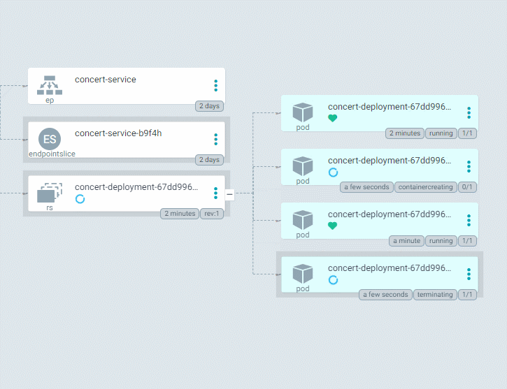

<br><br><br>

### 헬름차트를 이용한 쿠버네티스 리소스 관리
접은 내용

<br><br><br>

## ✔ 테스트 및 모니터링
### locust를 이용한 티켓팅 봇 및 성능테스트

티켓팅 서비스의 특성상, 특정한 시각에 대량의 트래픽을 발생시키고 성능을 테스트하는 것이 필요했습니다. 따라서 저희 팀에서는 locust를 채택하여 성능 테스트를 진행하였습니다. locust를 사용할 경우, 어떤 동작(Task)으로 서버에 부하를 가할 것인지 python 코드로 커스텀하는 것이 가능하고 재사용성이 높다는 장점이 있기 때문에 채택하게 되었습니다.


locust를 통해 기능 테스트와 부하 테스트를 동시에 진행하였으며, 각 요청들의 평균 응답시간과 `초당 요청 횟수(RPS)`를 쉽게 살펴볼 수 있었습니다. 또한, master / slave 구조를 통해 동시에 여러 request를 server로 전달하였습니다. 공연 선택부터 좌석 결제까지의 일련의 과정을 순차적으로 수행하는 [티켓팅 봇 python 코드](/locust_flask/bot.py)의 task는 아래와 같습니다.

- `get_concert_info` : 공연 정보 조회
- `check_seat` : 남은 좌석 수 조회, 남은 좌석이 없으면 테스트 중지
- `change_seat_state` : 점유된 좌석 목록을 불러오고 점유되지 않은 좌석을 선택하고 점유함
- `commit_reservation` : 이전 task에서 점유한 좌석을 예매, 에러가 발생하면 테스트 중지


위 티켓팅 봇을 이용하여 성능 테스트를 진행한 결과는 아래와 같습니다.
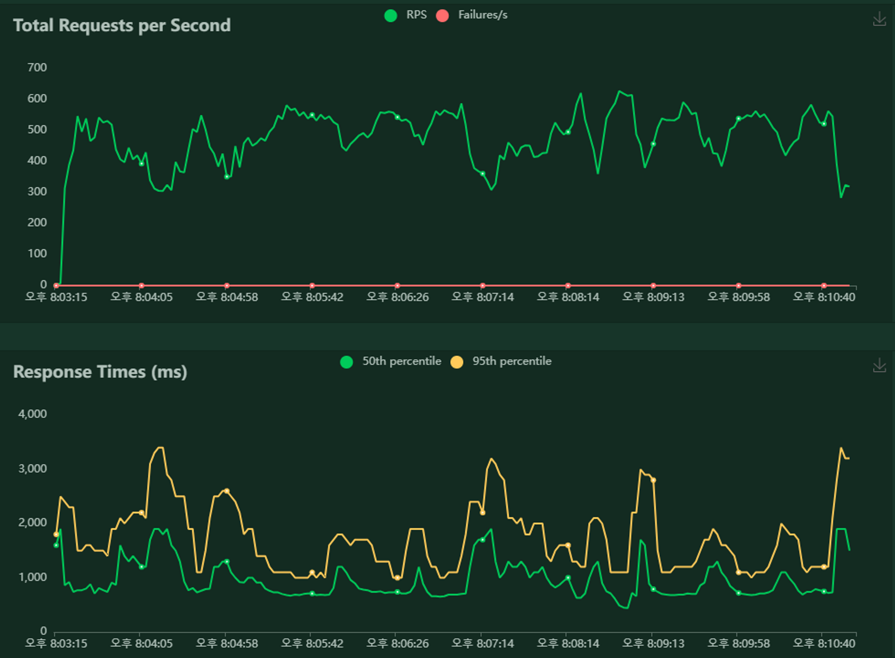 <br>

[엑셀 파일](/document/locust_result_230517.csv)로도 결과를 확인할 수 있습니다.
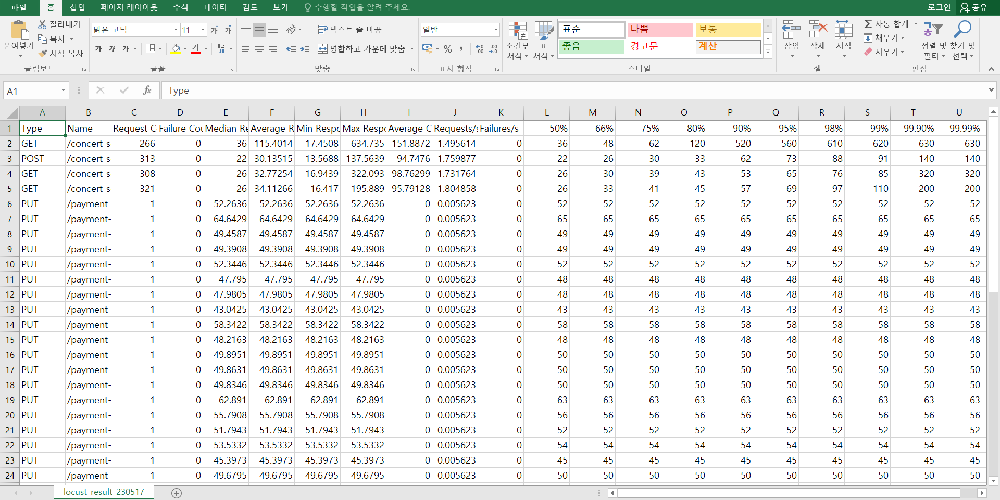

<br><br><br>

### jacoco를 이용한 코드 커버리지 측정

`코드 커버리지`란 테스트 케이스가 소스 코드의 어느 정도를 실행하는지를 측정하는 지표입니다. 코드 커버리지를 측정하면 개발자는 테스트된 코드의 비율을 알 수 있으며, 테스트되지 않은 코드 부분을 식별하여 추가 테스트가 필요한 영역을 파악할 수 있습니다.

`Jacoco`는 Java Code Coverage의 약자로, 다양한 커버리지 메트릭을 계산하기 위한 오픈 소스 프레임워크입니다. Jacoco는 런타임에 애플리케이션의 실행 경로를 추적하여 테스트된 코드와 테스트되지 않은 코드의 통계를 생성합니다.

저희 팀에서는 TDD의 중요성을 인지하고, 테스트 코드를 더욱 잘 구현하기 위해 jacoco를 프로젝트에 적용하기로 결정하였습니다.

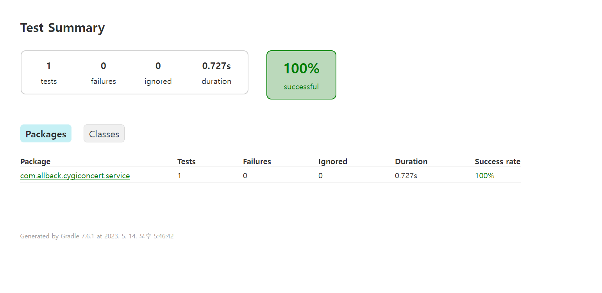 <br>
위 그림은 Concert 서버의 Test Summary입니다. Gradle을 통해 jacoco를 실행시키고 난 후, `build > reports > tests > test > index.html` 경로에서 확인할 수 있습니다. 작성한 테스트 케이스에 대한 요약을 볼 수 있습니다.

<br>
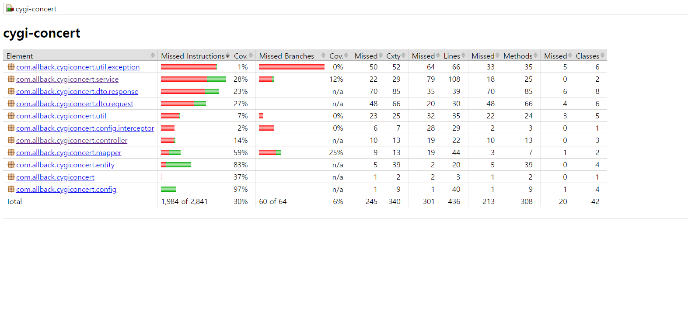 <br>
마찬가지로 Concert 서버에서 Gradle을 통해 jacoco를 실행시키고 난 후, `build > reports > jacoco > test > html > index.html` 경로에서 확인할 수 있습니다. 구체적으로 어떤 소스 코드가 테스트 케이스를 통해 실행됐는지, 안 됐는지 파악할 수 있습니다.  
<br>

시간 상의 문제로 인해 아직 테스트 코드를 많이 작성하지 못하여 테스트 커버리지 지표가 낮게 나왔지만, 향후에 테스트 코드를 추가하여 프로젝트를 발전시켜 나갈 계획입니다.

<br><br><br>

### ELK Stack + kafka를 이용한 로그 수집
ELK는 Elastic Search, Logstash, Kibana의 약자로, 데이터를 수집하고 분석하는 도구 모음을 의미합니다. Logstash는 데이터 처리 파이프라인 도구, Elastic Search는 검색 엔진, Kibana는 데이터 시각화 대시보드입니다.  
Beats는 경량 데이터 수집기로서, 로그 파일을 저장하고 데이터 ship 역할로서 Logstash로 전송합니다.
Beats와 Logstash의 역할이 거의 흡사하다고도 볼 수 있습니다. 그렇지만, log가 발생하는 모든 각 spring 서버마다 Logstash를 설치하기에는 용량이 무겁기 때문에, Beats를 도입하였습니다.  
ELK + Beats를 합친 용어로 Elastic Stack이라고 부릅니다.  
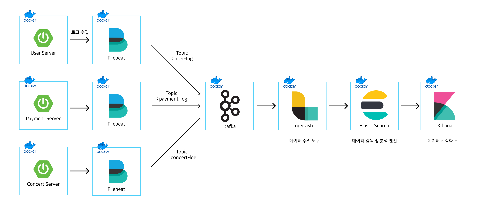  
ELK는 다양한 용도로 사용될 수 있지만, 저희 프로젝트에서는 각 서버에서 발생하는 로그를 수집하는 목적으로 사용하였습니다.
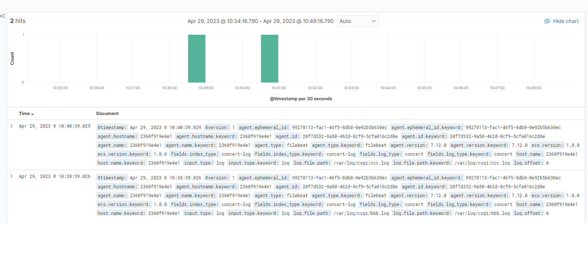

<br><br><br>

### grafana와 prometheus를 이용한 자원 관리
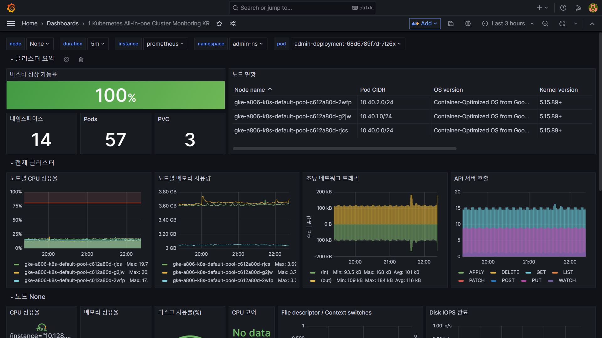

<br><br><br>

## ✔ 정산 시스템
### Spring Batch를 이용한 정산 시스템
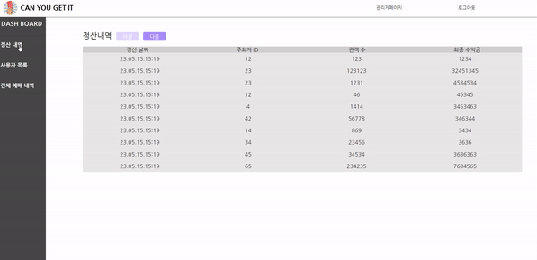 <br>
정산 순서

    1. 매일 종료되는 공연의 정산금액을 계산
    2. 각 공연 담당자에게 정산금액 지급

`Spring Batch` 는 엔터프라이즈 시스템의 일상적인 운영에 필요한 배치 애플리케이션을 쉽게 개발할 수 있도록 설계된 강력한 프레임워크입니다. 이는 로깅/추적, 트랜잭션 관리, 작업 처리 통계, 작업 플로우 지정(작업을 재시작하거나 스킵), 리소스 관리 등 대량의 레코드를 처리하는 데 필수적인 기능을 재사용 가능한 형태로 제공합니다.

`Spiring Batch` 를 이용한 정산시스템 구현방식은 다음과 같습니다.

- Spring Batch 관리 도구로서 Jenkins를 사용하여 스케쥴링 및 배치서버 관리
- 조건별 흐름제어가 가능한 FlowJob를 사용하여 각 Step의 순서를 제어
- Chuck 지향 처리 : ItemReader, ItemProcessor, ItemWriter를 통해 Chuck 단위 만큼 데이터를 처리하고 트랜잭션이 발생하도록 구현
- ItemReader : 정산이 필요한 데이터를 Chuck 단위로 조회
- ItemProcessor : 정산처리 및 데이터 변환
- ItemWriter : 완료된 정산데이터 데이터 등록

<br><br><br>

## ✔ 대기열 시스템

### kafka를 이용한 대기열 시스템
대기열 시스템은 client가 서비스를 요청했을 때 이 요청들을 차례대로 처리하는 시스템입니다. 티켓팅 시각에 맞추어 수많은 client들이 한꺼번에 요청을 보낼 경우, 서버가 부하를 이기지 못하고 장애가 발생할 수 있습니다. 따라서 서버 장애를 방지하고 안정적인 운영을 위해, 동시에 몰린 client들의 요청들을 차례대로 줄을 세우고 차근차근 처리할 수 있도록 `대기열 시스템`을 도입하였습니다.
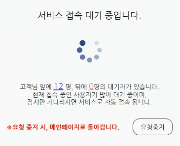 <br>
대기열 시스템을 통해 위와 같이 내 앞에 몇 명의 요청이 남아있는지, 내 뒤에 몇 명의 요청이 쌓여있는지를 실시간으로 확인할 수 있습니다.


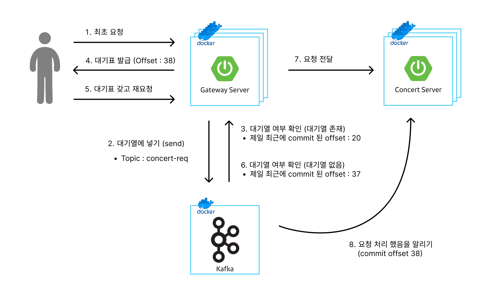
대기열 시스템의 client의 요청은 다음 세 가지로 분류할 수 있습니다.  

1. 최초 요청  
일반 다른 요청들과 다를 바 없습니다. 만일 내 앞에 대기열이 존재하지 않는다면, 그 즉시 원하는 응답을 받을 수 있지만, 그렇지 않고 내 앞에 대기열이 존재할 경우 307 http status code와 함께 대기표 정보를 응답으로 받습니다. 대기표에는 아래 정보가 담겨져서 옵니다.
- `uuid` : 대기표 고유 번호
- `offset` : kafka에 담긴 대기표 레코드의 offset 값 (나의 대기 순번)
- `partition` : 나의 대기표 레코드가 담긴 kafka의 partition 번호
- `committedOffset` : 제일 최근에 처리 완료된 레코드의 offset 값
- `endOffset` : 제일 최근에 요청이 들어온 레코드의 offset 값

2. 재요청 (polling)  
최초 요청에서 307 코드를 응답으로 받았다면, client는 원래 원했던 응답을 받을 때 까지 서버에게 재요청을 보냅니다. 재요청을 보낼 때는 최초 요청에서 응답받았던 대기표를 요청 정보에 함께 담아서 전송해야합니다. 만일 대기표를 요청 정보에 담지 않고 보낸다면, server에서는 해당 요청을 최초 요청으로 간주하고 대기순서를 맨 뒤로 보내버립니다.
계속해서 재요청을 보내면서 내 차례가 왔는지 확인하고, 내 차례가 왔다면 2xx 응답 코드와 함께 정상 응답을 받습니다. 아직 내 차례가 오지 않았다면 최초 요청 때와 마찬가지로 307 응답 코드와 함께 대기표 정보를 갱신해서 받습니다.
- `내 앞에 쌓인 요청 수` = `offset` - `committedOffset` - `1`
- `내 뒤에 쌓인 요청 수` = `endOffset` - `offset`

3. 취소 요청  
client가 대기표를 끊어놓은 후, 정상 응답을 받기도 전에 대기줄에서 이탈할 때 보내는 요청입니다. 대기표 취소 요청을 전송하면 server에서는 해당 대기표 순서가 왔을 때 건너뛰게 됩니다. kafka에서는 한 번 쌓인 레코드는 삭제 및 변경이 불가능하기 때문에 별도의 로직이 필요했습니다.

<br><br><br>

## ✔ 프론트
### Observer를 이용한 무한 스크롤 구현

<br>
observer 객체를 생성하여 페이지 위치가 하단 div를 감지합니다. 하단 div를 감지하면 API 통신 refetch를 통해 다음 페이지의 데이터를 자동으로 호출함으로써 무한 스크롤 기능을 구현하였습니다.

<br><br><br>

### Recoil을 활용한 로그인 정보 유지
로그인 후 페이지를 이동해도 로그인 정보를 유지하기 위해 Recoil 변수에 회원정보를 담아서 상태를 관리하였습니다.

<br><br><br>

## ✔ 기타
### OAuth를 이용한 카카오 로그인
 <br>
Oauth를 사용해 kakao Id로 사용자 인증을 진행<br>
획득한 유저 정보가 DB에 존재하지 않으면 회원가입<br>
획득한 유저 정보가 DB에 존재하면 JWT를 발급하고 로그인 처리<br>
유저 정보를 기반으로 발급한 JWT를 OauthSuccessHandler에서 Redis에 저장<br>
로그아웃시 Redis에서 AccessToken과 RefrashToken을 모두 삭제

<br><br><br>

### 카카오페이 연동을 통한 포인트 충전 시스템
 <br>

프론트엔드 처리<br>
카카오페이 충전버튼을 누르면 cid, partner_order_id, partner_user_id, item_name, quantity, total_amount 등의 정보를 담은<br>
데이터 객체를 parameter로 하여 post방식으로 API 통신<br>
응답 성공시 생성되는 tid 값을 localstorage에 담아 next_redirect_pc_url로 페이지 이동<br>
카카오페이 페이지 이동 시 결제 승인 요창 : API POST 통신 =>  cid, tid, partner_order_id, partner_user_id, pg_token 값이 담긴 데이터를 전달하여 비교<br>
응답 성공 시 결제 승인 성공, 포인트 충전

<br><br><br>

---

# 🔧 기술 스택

`Backend`

- intelliJ IDE
- springboot 3.0.6
- spring cloud netflix eureka
- spring cloud gateway
- spring cloud zipkin
- spring cloud sleuth
- spring cloud openfeign 4.0.2
- spring Data JPA
- spring batch
- java 17
- jacoco
- mockito
- jwt
- junit
- mapstruct
- gradle
- swagger

`Data`

- mySQL
- redis
- AWS S3
- kafka

`Frontend`

- visual Studio Code IDE
- reactJS 18.2.0
- javaScript
- recoil 0.7.7
- nodeJS
- axios 1.3.5
- react-query

`Infra`

- mobaxterm
- AWS EC2
- GKE
- kubernetes
- nginx
- jenkins
- docker
- docker-compose

`test`

- locust
- python

`monitoring`

- grafana

`logging`

- elasticsearch
- logstash
- kibana
- filebeat

`etc`

- gitlab
- notion
- jira
- mattermost

<br>

---

# 📃 프로젝트 산출물

- [ERD](/document/img/erd_1.png)
- [mockup](https://www.figma.com/file/mw4MG7BWS4pTuwP6IdyyM6/A806?type=design&node-id=0-1&t=QhgkgtSFgvbPmMsr-0)
- [API 명세서](https://twilight-twig-a89.notion.site/API-c5f6f2e26c0d4ae3823e59ee6afbbe49)
- [기능 명세서](https://twilight-twig-a89.notion.site/d6b5fbdd6df443f9b07a57873be5e461)
- [Flow Chart](/document/img/flow_chart.png)
- [발표 ppt]()
- [포팅 매뉴얼]()

---

# 💑 협업 환경

## Git

# Git Convention

# Git Message Convention

### 1) **기본 형식**

`[commit type]: [commit message] ([jira ticket number])`

ex:

`add: 프로젝트 추가`

`feat: 로그인 구현`

### **2) commit type**

| 구분자 | 작업 유형 | 예 |
| --- | --- | --- |
| add | 파일 추가 | 프로젝트나, 설정 파일 추가 |
| feat | 새 기능 구현 | feat: 락커 회원 목록 검색 기능 추가 (S2-2345) |
| fix | 버그 수정 | fix: 상점 목록의 에러처리 예외케이스 대응 (S2-2356) |
| docs | 문서(또는 주석) 관련 작업 | docs: 데코레이터 옵션에 대한 문서 추가 (S2-2345) |
| refactor | 리팩터링 | refactor: createStore의 함수를 작은 함수로 분리 (S2-2345) |
| test | 테스트 관련 작업 | test: 상점 생성 테스트 추가 (S2-2345) |
| chore | 기타 작업 | chore: 프로덕션 빌드시 소스맵 생성하도록 변경 (S2-2334) |

### **3) commit message**

이번 커밋에서 작업한 내용을 간결하게 설명합니다.

### **4) jira ticket number**

Jira에 등록한 이슈의 번호를 적습니다. 연관 티켓이 없다면 작성하지 않습니다.

## **2. 작성 규칙**

- 제목은 50자를 넘지 않아야 합니다.
- 본문은 한 줄에 80자를 넘기지 않습니다.
- 문장의 끝에 구두점(.)을 끝에 찍지 않습니다.
- 문장은 명사로 끝나야 합니다.
- 제목과 본문 사이는 한 줄을 개행하여 분리합니다.

## **3. commit 작성 예**

```
feat: 프렌즈 지원하기 버튼에 GA 이벤트 태그 추가 (PP-2345)

[본문] 구글 광고를 지원하기 위해서 GA이벤트 태그가 아닌 구글 애드센스 추적 코드를 삽입합니다.
또한, 프렌즈 지원하기 버튼에 정의된 이벤트 태그를 보내는 기능을 추가합니다.
```

# Git Branch Convention

### 1) Branch Name 전략

`[branch name]/[담당자 이니셜]/[type]`

ex) ‘김동연(DY)’이 oauth2 관련 로직을 개발할 경우 브랜치 

- feat/dy/oauth2

### 2) Branch Name

| 구분자 | 작업 유형 |
| --- | --- |
| master | 배포 가능한 완성 상태 |
| release  | 배포 중인 상태 |
| develop | 오류 없는 구현 상태 |
| feature  | 개발 중인 상태 |

### 3**)** Branch T**ype**

| 구분자 | 작업 유형 |
| --- | --- |
| AD | 안드로이드 |
| FE | WEB Front |
| BE | Backend |
| BC | 블록체인 |

- git branch 전략

## 회의

- 캘린더를 사용하여 일정 관리
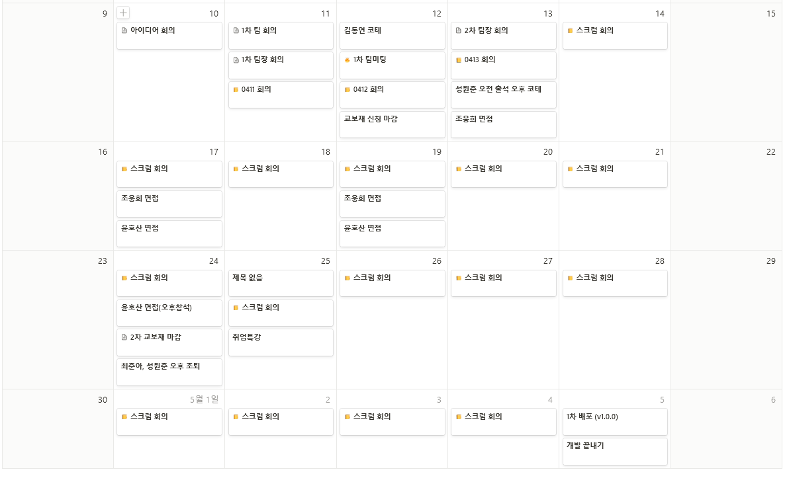 <br>

- 캘린더 내용 세부사항
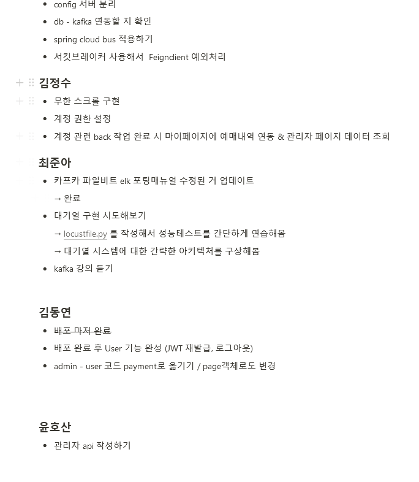 <br>

## Notion

## Jira

매주 인당 40 story point 할당
매주 월요일 스프린트를 시작해서 금요일에 종료
story -> 산출물 없음
task -> 산출물 있음
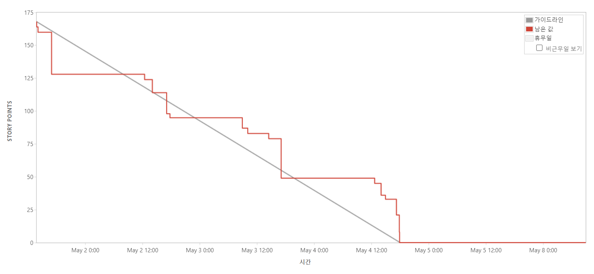 <br>

##

---

